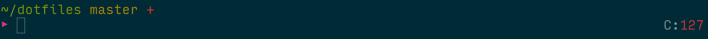

```
                       _      _
           |          | | o  | |
         __|   __ _|_ | |    | |  _   ,
        /  |  /  \_|  |/  |  |/  |/  / \_
        \_/|_/\__/ |_/|__/|_/|__/|__/ \/
                      |\
                      |/
```

I use these across my work and personal machines. On my personal machine I use
Ubuntu with [zsh](http://ohmyz.sh/), [i3](http://i3wm.org/) and [NeoVim](https://neovim.io/), and for
work I use Windows 7 with [zsh](http://ohmyz.sh/), [babun](https://babun.github.io/), tmux & Vim.
On both machines I make things pretty with the classic [Solarized](http://ethanschoonover.com/solarized) colour scheme
and the [Input](http://input.fontbureau.com/) font.



## Linux machine

### .fonts

Symlink to this in your `$HOME` directory and you have all the niceness of a
range of fonts. I've been stuck on Input for a while now.

### .i3

This is another thing that comes under the banner of *things I use because
@jessfraz uses it*. Ubuntu is great but I never enjoyed its desktop
environment. For I long time I used Xubuntu, and was too timid to properly look
into a window manager. It was nothing to be scared of, i3 is amazing. While
it did take a little while to get used to, it makes the Linux desktop experience
so much more intuitive and simplified. [These](https://www.youtube.com/watch?v=j1I63wGcvU4&list=PL5ze0DjYv5DbCv9vNEzFmP6sU7ZmkGzcf)
videos from @bookercodes were invaluable for getting things set up.

### .Xresources

This confgures my terminal, rxvt-unicode.

## Windows machine

I have the ugly Windows 7 taskbar permanently hidden, thanks to
[this](http://rocketdock.com/addon/misc/3425), but keep access to the Tray with
[this](http://rocketdock.com/addon/docklets/35659), and then use
[RocketDock](http://rocketdock.com).

### .babunrc

This is pretty much just the default configuration file that comes with Babun,
but with the last line making sure we can ignore annoying BLODA warnings.

### .minttyrc

Configures the appearance of the console used by Babun. Applies the Solarized
colour scheme.

### .ptpython

A better Python REPL. On Linux I prefer [bpython](http://bpython-interpreter.org/) though.

### .tmux.conf

I only really have tmux to have a status line and split panes in my Windows
console. I have permanently hidden the Taskbar, and it's nice to have the time
on view. And split panes are so useful, yet Babun doesn't have them. I did use [cmder](http://cmder.net/)
for a while but could never get vim to work properly.


